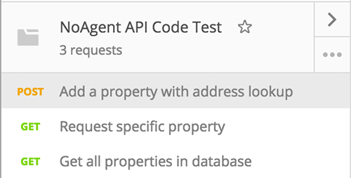

# NoAgent API Code Test

In this repo you will find my code test application, I wanted to spend some quality time on implementing the API.

The brief says to require `Address Line 1, Address Line 2, City, Postcode` however `Address Line 2` is nullable/not required as it is only essential to have the first line address and postcode for the Geocoder.

#### How to set up the project
- `git clone`
- copy `.env` file into project directory
- `vagrant up`

That is it, it will provision the site it will be available at [http://noagent-test](http://noagent-test).

#### Dev tasks
- [x] Install and configure Laravel and Homestead.
- [x] Create model for properties
- [x] Create migration scripts to init project.
- [x] Find way for ORM to support UUIDs to make properties table more portable e.g. not restricted by an `id` index.
- [x] Version API e.g. `/api/v1`
- [x] Create custom google geocoder service.

#### Endpoints

| Method | URI | API Requirement |
| ------ | --- | ----------- |
| `GET/HEAD` | `/` | Nothing special, version. |
| `GET/HEAD` | `/properties` | List all properties. |
| `POST` | `/properties` | Add a property, requiring only the address. |
| `GET/HEAD` | `/properies/{property}` | Retrieve a specific property. |

There is a file named [NoAgent API Code Test.postman_collection.json](NoAgent API Code Test.postman_collection.json) to import into _Postman_ REST client with the three endpoints.

#### Notes
- **#ORMGate** No automatic model configuration still in the ORM!
- **Google Geocoder** Using a HTTP library for google maps was a fun task, it ends up pretty shocking code when not using a library 😅.
- **Homestead w/ Virtualbox Shared Folders** API requests take ~500ms to respond because of the slow.
file storage loading all the PHP includes. They should really be under 100ms at the very least!